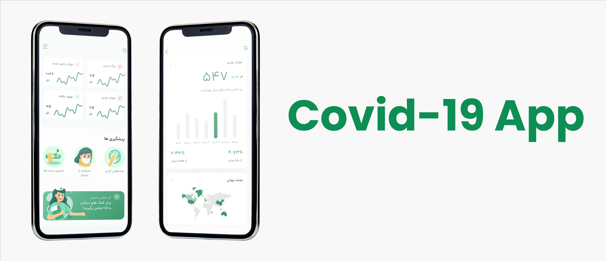
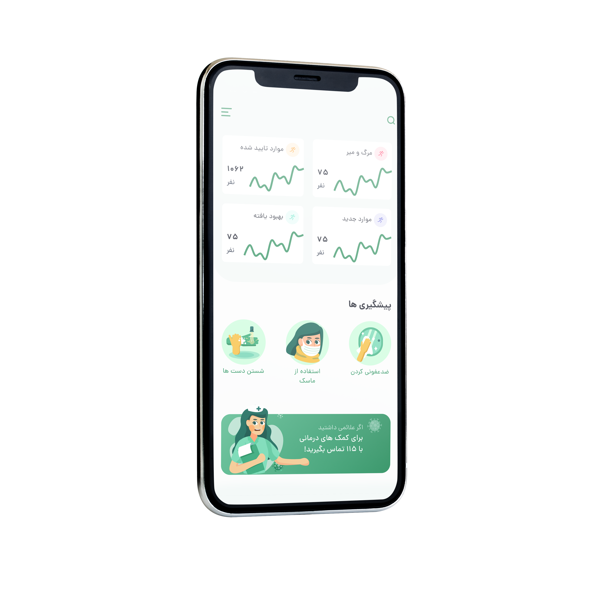
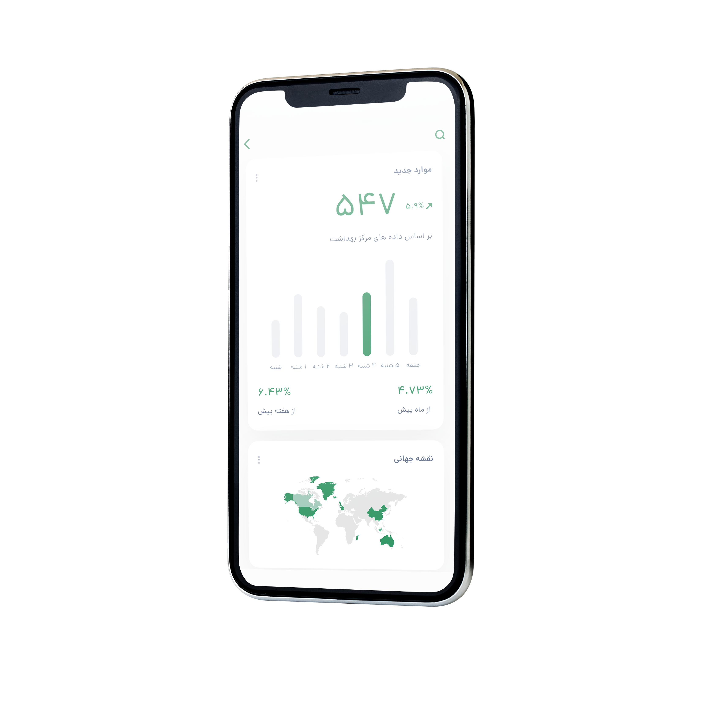

<div style="text-align: right;">
<h1>Covid-19 App</h1>
</div>
یک اپلیکیشن سبک و ساده که آمار ضروری بیماران کووید-۱۹ را در کنار روش‌های عملی پیشگیری نمایش می‌دهد. این برنامه بر سادگی، وضوح و ارائهٔ قابل‌فهم اطلاعات تمرکز دارد تا به کاربران در مطلع‌ماندن کمک کند. ساخته شده توسط [DivSlayer](https://DivSlayer.github.io)


## ساخته شده توسط 🛠
<div style="text-align: right;direction:rtl">
    <ul>
        <li>[فلاتر] برای طراحی UI , UX</li>
    </ul>
</div>

## نصب
برای نصب این اپلیکیشن، دستورات زیر را اجرا کنید:

```bash
git clone https://github.com/DivSlayer/covid-19-app.git
cd covid-19
flutter build apk
```

## تصاویر 📸
| خانه | نمودار |
|----------------------|----------------------|
|||


