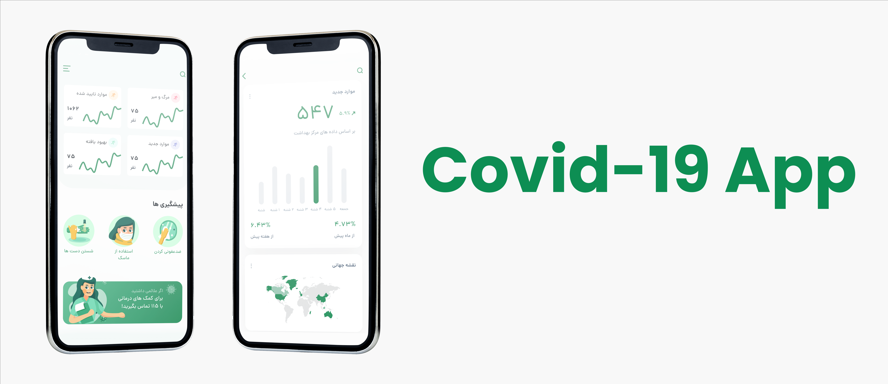

<div style="text-align: right;">
<h1>Covid-19 App</h1>
</div>

این اپلیکیشن ساده آمار بیماران و راه‌های پیشگیری در مورد کووید-۱۹ را نمایش می‌دهد. ساخته شده توسط [Geeksloths](https://geeksloths.github.io)


## ساخته شده توسط 🛠
<div style="text-align: right;direction:rtl">
    <ul>
        <li>[فلاتر] برای طراحی UI , UX</li>
    </ul>
</div>

## نصب
برای نصب این اپلیکیشن، دستورات زیر را اجرا کنید:

```bash
git clone https://github.com/your-username/covid-19.git
cd covid-19
flutter build apk
```

## تصاویر 📸
<div style="display:flex;align-items:center">
    <span style="width:100%">
       
    </span>
    <span style="width:100%">
       
    </span>
</div>

